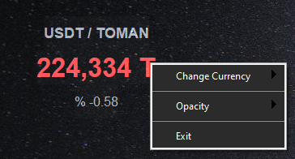

# 📈 Live Crypto Desktop Widget

A sleek, borderless, and always-on-top desktop widget for tracking real-time cryptocurrency prices (USDT, BTC, ETH) directly on your Windows desktop. Built with Python.



## ✨ Features
* **Acrylic Glass UI:** Modern, semi-transparent titanium design that blends perfectly with Windows 11/10 wallpapers using `pywinstyles`.
* **Real-Time Tracking:** Fetches live market data every 3 seconds without freezing the UI (Powered by Python Multi-threading).
* **Smart Trend Indicators:** Automatically changes the price color based on market trends (Green for uptrend, Red for downtrend).
* **Draggable & Borderless:** Completely borderless window that can be dragged and placed anywhere on the screen.
* **Custom Context Menu:** Right-click anywhere on the widget to change the currency, adjust glass opacity, or exit safely.
* **Anti-Ban & Cache Bypass:** Uses smart headers and timestamping to prevent API blocking and avoid server-side caching.

## 🚀 Download & Run (For End Users)
If you don't want to code and just want to use the widget:
1. Go to the **[Releases](../../releases)** tab on the right side of this page.
2. Download the `LiveCryptoWidget.exe` file.
3. Run it directly on your Windows machine (No installation required).

## 💻 Development & Setup (For Developers)
If you want to run the source code or modify it:

### Prerequisites
Make sure you have Python 3.8+ installed on your system.

### Installation
1. Clone the repository:
   ```bash
   git clone https://github.com/TahaZaimi/Live-Crypto-Widget.git
   ```
2. Install the required dependencies:
   ```bash
   pip install -r requirements.txt
   ```
3. Run the application:
   ```bash
   python main.py
   ```

## 🛠️ Built With
* [CustomTkinter](https://github.com/TomSchimansky/CustomTkinter) - Modern GUI library for Python
* [Requests](https://docs.python-requests.org/) - Elegant HTTP library
* [PyWinStyles](https://github.com/awekrx/pywinstyles) - Windows native UI effects (Acrylic/Mica)
* **Wallex API** - Real-time cryptocurrency market data

## 👨‍💻 Author
**Mohammad Taha Zaimi**
* GitHub: [@TahaZaimi](https://github.com/TahaZaimi)
